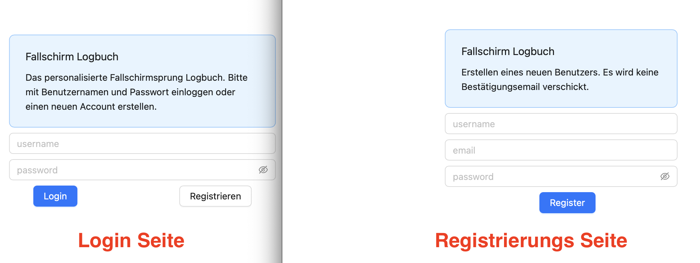

# Fallschirmspringer Logbuch


## Management Summary

Als ambitionierter Fallschirmspringer und ehemaliger Schweizermeister im Freefly Skydiving weiss ich um die
Wichtigkeit des korrekten führens eines Sprung-Logbuchs, um jeden Fallschirmsprung nachvollziehen zu können.
Dies wird meistens schriflich (offline) gemacht. In dieser Projektarbeit erarbeite ich eine online Alternative zum 
führen eines Logbuchs für Fallschirmpringer.

Benutzer können nach erfolgreicher Registration und Login ihre Sprünge mit Datum und Beschreibung speichern
und anzeigen lassen.

Die Anwendung wurde "von Grund auf" geschrieben (kein Aufbau auf einer existierenden Software), und verwendet
 die Technologien:
  * `Flask` (für das Backend),
  * `Postgres` (für die Datenbank), und
  * `React` (für das Frontend). 


## Anwendung

### Bedienung (User-Manual)

Die Anwendung ist unter `http://phgmuer.logbuch.link` (oder direkt via IP `52.91.154.213`) erreichbar, und
in zwei Teile unterteilt:
* User-Management: Registrieren, einloggen, und Session Management,
* Logbuch Funktionlität: Hinzufügen und auflisten der Fallschirmsprünge

#### User-Management

Die Startseite `http://phgmuer.logbuch.link/` enthält den Login Screen mit einem Username/Passwort Feld, 
sowie einem Link zu der Registrierungsseite.


Die Registrierungsseite `http://phgmuer.logbuch.link/register` fragt nach einem Benutzernamen, Passwort und
Email. Die Emailadresse wird jedoch **nicht** verifiziert, das heisst es wird keine Registrationsemail wird veschickt.
Dies wäre eine mögliche Erweiterung des Projekts.


#### Logbuch Funktionalität

Nach dem Login wird der Benutzer auf die Seite `http://phgmuer.logbuch.link/home` weitergeleitet, welche
die Hauptfunktionalität darstellt. Diese besteht aus zwei Unterseiten zum Hinzufügen und Auflisten der Fallschirmsprünge


Die Felder `1` und `2` werden benutzt um die Sprungdaten einzugeben: Einerseits das Sprungdatum und andererseits eine
Beschreibung des Sprunges.
Mit dem `Speichern` Knopf `3` wird der Sprung ans Backend geschickt und persitiert.

Der Titel `A` enthält den Benutzernamen des eingeloggten Users, und die Menüleiste `B` und `C` erlaubt es zwischen
den zwei Komponenten hin-und-her zu wechseln.


Die Listen Komponente zeigt alle gespeicherten Sprünge als Timeline, sortiert nach Sprungdatum.

### Architektur
Die App ist in zwei Hauptfunktionlitäten aufgeteilt: Benutzerverwaltung und Sprungerwaltung. Beide davon haben
eine Enstprechende Frontend [src/client/components/](https://github.com/phgmuer/skydive/tree/main/client/src/components) und
Backend [src/api/](https://github.com/phgmuer/skydive/tree/main/api) Komponente.


#### Benuzterverwaltung

Die Benutzerverwaltung erlaubt das Erstellen von Benutzern, Abfragen der Logins und Verwalten der 
User Sessions.


Beim login wird von der Frontend Komponente [src/client/components/pages/LoginPage.js](https://github.com/phgmuer/skydive/blob/main/client/src/components/pages/LoginPage.js)
eine `HTTP GET` Anfrage an `http://phgmuer.logbuch.link:5000/auth/login` mit folgenden
Parametern gemacht:
* `username`
* `password`

Das `password` wird mittels SHA256 gehashed und in der Tabelle `accounts` mit dem usernamen verglichen. Das heisst
die Passwörter werden **nicht** im Klartext gespeichert und sind so besser geschützt.

Falls das Password richtig ist, wird für den User eine neue Session mit einem zufälligen `token` erstellt, und in der
Tabelle `sessions` gespeichert. Das Token wird danach auf der Client-Seite in dem Local Storage gespeichert und
für jeden weiteren weiteren Request (zum auflisten oder hinzufügen der Sprünge) vom Frontend mitgeliefert und
server-seitig kontrolliert. So wird sichergestellt dass ein user wirklich korrekt eingelogged ist.

Bei einem erfolgreichem login Versuch gibt der Endpunkt den Status `200` mit den Session Daten und dem
Feld `success: true` zurück.
Mit inkorrekten Login Daten eine Entsprechende Fehlermeldung und `success: false`.

Beispiel

```
$ curl "http://phgmuer.logbuch.link:5000/auth/login?username=test&password=richtigesPassword"
{"loginUsername":"test","sessionId":7,"sessionToken":"hidxntkqlgkndnzxwysa","success":true}
$ curl "http://phgmuer.logbuch.link:5000/auth/login?username=test&password=falschesPassword"
{"message":"Verification failed.","success":false}
```


Die Registrierung eines neuen Benutzers funktioniert ähnlich:
Von der Frontend Komponente [src/client/components/pages/RegisterPage.js](https://github.com/phgmuer/skydive/blob/main/client/src/components/pages/RegisterPage.js)
jedoch wird ein `HTTP PUT` Request an `http://phgmuer.logbuch.link:5000/auth/register` mit den Feldern
* `username`
* `password`
* `email`

geschickt. Der Backend Code in `Database.createUser` überprüft zuerst ob der gewählte Benutzername noch frei ist, und falls
 ja fügt den Benutzername und (Hash des) Passwort in die Tabelle `accounts` ein.


#### Sprungverwaltung


Die Sprungverwaltung hat zwei Komponenten:
* Abfragen der Sprünge des eingeloggten Benutzers,
* Hinzufügen eines neuen Sprunges für den eingeloggten Benutzer.

Für das Abfragen der Sprünge wird von [src/client/components/jumps/ListJumps.js](https://github.com/phgmuer/skydive/blob/main/client/src/components/jumps/ListJumps.js) eine `HTTP GET` Anfrage an den Endpunkt 
`http://phgmuer.logbuch.link:5000/jumps/list` mit den Feldern
* `sessionToken`
* `sessionId`
geschickt.
Die beiden Werte `sessionToken` und `sessionId` identifizieren die aktiv-eingeloggte `session`.
Auf dem Backend wird zuerst mittels der sessions Tabelle von der aktiven Session auf den Benutzer übersetzt, und danach
in der Tabelle `jumps` alle sprünge für den Benutzer abgefragt.

Eine erfolgreiche Anfrage gibt alle Sprünge als Json zurück

```
$ curl "http://phgmuer.logbuch.link:5000/jumps/list?sessionId=7&sessionToken=hidxntkqlgkntnzxwysa" | jq
{
  "jumps": [
    {
      "date": "2023-02-13",
      "description": "Spasssprung am Abend"
    },
    {
      "date": "2022-10-10",
      "description": "Trainingssprung Team FFS am Fallschirmplatz Triengen. Einstudierte Choreographie. Absetzflugzeug: Porter."
    },
    {
      "date": "2022-07-05",
      "description": "Sunset Sprung in Beromünster aus 4000. Flugzeug Cessna Caravan."
    },
    {
      "date": "2022-06-28",
      "description": "Heissluftballon 06:00. Gute Sicht. Absprung über Huttwil aus 2500m über Grund"
    },
    {
      "date": "2022-06-17",
      "description": "Organisierter Sprung am Freefly Festival in Grenchen mit 4 Springern. Flugzeug Pink Skyvan."
    }
  ],
  "success": true
}
```

Das Hinzufügen eines Sprunges geschieht via `PUT` Request von [src/client/components/jumps/AddJump.js](https://github.com/phgmuer/skydive/blob/main/client/src/components/jumps/AddJump.js)
an den Endpoint `http://phgmuer.logbuch.link:5000/jumps/add`.
Die Benötigten request felder sind wiederum `sessionToken` und  `sessionId`, sowie die Sprungdaten:
* `jumpDate` -- das Datum des Sprungs, und
* `jumpDescription` -- die Beschreibung.

Ein Beispiel Request:

```
$ curl "http://phgmuer.logbuch.link:5000/jumps/add?sessionId=9&sessionToken=xxzcjxcwuvtemgetowzg" -X PUT --data-binary '{"jumpDate":"2023-01-01","jumpDescription":"Test"}' 
{"success":true}
```


#### Zusammenfassung Endpoints

```
* /auth/login -- Login eines Benutzers.
* * HTTP GET
* * Requestfelder: username, password

* /auth/register -- Erstellen eines Benutzers.
* * HTTP PUT
* * Requestfelder: -
* * Datenfelder: username, email, password

* /auth/username -- Abfragen des Benutzernamens einer Session.
* * HTTP GET
* * Requestfelder: -
* * Datenfelder: username, email, password

* /jumps/list -- Auflisten der Sprünge.
* * HTTP GET
* * Requestfelder: sessionId, sessionToken

* /jumps/add -- Hinzufügen eines Sprunges.
* * HTTP PUT
* * Requestfelder: sessionId, sessionToken
* * Datenfelder: jumpDate, jumpDescription
```

## Infrastruktur

Die App wird auf AWS gehosted, mit zwei Komponenten:
* EC2 Serving Instanz.
* EDS Postgres Datenbank,

AWS ist der Marktführer im Cloud Computing und bietet ein umfangreiches Angebot sowie viele Resourcen und Dokumentationen zur Verfügung.
Die notwendige Konfiguration der beiden Komponenten geschieht einfach über die AWS Webkonsole:
* Erstellen/Starten/Stoppen der EC2 Instanz,
* Öffnen der korrekten Ports,
* Erstellen der Datenbank, sowie erlauben des internen Traffics von der EC2 instanz zur Datenbank.


Die geöffeten Ports erlauben folgende Verbindungen


Um einerseits den Zugriff von aussen auf die EC2 Instanz zu erlauben und andererseits von der EC2 Instanz auf die EDS
Datenbank.


### Serving

Ich clone das komplette GIT Repository direkt auf die EC2 Maschine. Dies kann entweder durch das manuelle hochladen
des Repositories (via `zip` file und `scp`) oder mit `git clone` von der EC2 Instanz geschehen.

Danach installiere ich manuell `docker`, `python` und `docker-compose` (via `yum` und `pip3`) und
füge füge den EC2 user zur korrekten Gruppe hinzu (von [hier](https://gist.github.com/diegopacheco/a63abbdb128592a758687d222bbd3392)).

Danach starte ich die serving Instanz mittels `docker-compose up --build` und der Konfugrationsdatei
[docker-compose](https://github.com/phgmuer/skydive/blob/main/docker-compose.yml).

In der `docker-compose.yml` sind drei kleine Änderungen zwischen der lokalen Entwicklungsumgebung markiert.
Der wichtigste davon ist das Ausführen von `npm build` anstelle von `npm start`. Die entsprechenden
`npm` Befehle sind im [package.json](https://github.com/phgmuer/skydive/blob/main/client/package.json) definiert.

In der `npm start` (zur lokalen Entwicklung) werden die Frontend Anfragen direkt von `react-scripts` beantwortet,
und änderungen am Skript werden so direkt ausgeführt.

Mit `npm build` hingegen, werden die `react` komponenten lediglich vorbereitet und dann durch den
statischen HTTP Server `serve` zur Verfügung gestellt.

Mehr Details finden sich in der offiziellen `react` Dokumentation [hier](https://create-react-app.dev/docs/deployment/).
 
Zu einem späteren Zeitpunkt sollten das erstellen/kreieren des Docker Images ausserhalb der Serving Infrastruktur
geschehen um die einzelnen Komponenten besser zu isolieren. 


### Postgres

Postgres wurde mehrheitlich gewählt weil es eine modernere Alternative zu MySQL ist. Desweiteren ist die lokale Installation
für das testen und iterieren während der Entwicklung sehr einfach.
Die gleiche Funktionalität könnte aber auch gut durch eine andere Datenbank Lösung abgedeckt werden, und die Code-Anpassungen wären minimal.

Die Befehle zur Erstellung der notwendigen Tabellen finden sich in https://github.com/phgmuer/skydive/blob/main/api/database/init.sql

Da die Datenbank nur von der EC2 Instanz erreichbar ist (nicht aber von extern), muss zum Installieren zuerst via
SSH auf die EC2 Instanz verbunden werden und danach den Postgres Client von AWS zu installieren um damit die `init.sql`
Befehle auszuführen.

```shell script
$ PGPASSWORD=<DatenbankPassword> psql -U postgres -h  <DatenbankHost>  -f init.sql
$ sudo amazon-linux-extras install postgresql10
```

Die Platzhalter `DatenbankPassword` und `DatenbankHost` sind mit den entsprechenden Werten zu ersetzen.

Neben dem erstellen der Datenbank und Tabellen, kreiert obiges Skript ebenfalls secondary Indizes auf den Tabellen:
* `sessions` für Spalte `session_token`,
*  `jump` für Spalte `user_id`),
*  `accounts` für Spalte `username`.

Die Indizes reflektieren die verwendeten Zugriffsformen auf die Datenbanken (abgesehen der Primary Keys), und stellt
einen schnellen Zugriff sicher.
Mit der aktuell geringen Datenmengen wären sie jedoch nicht nötig.
